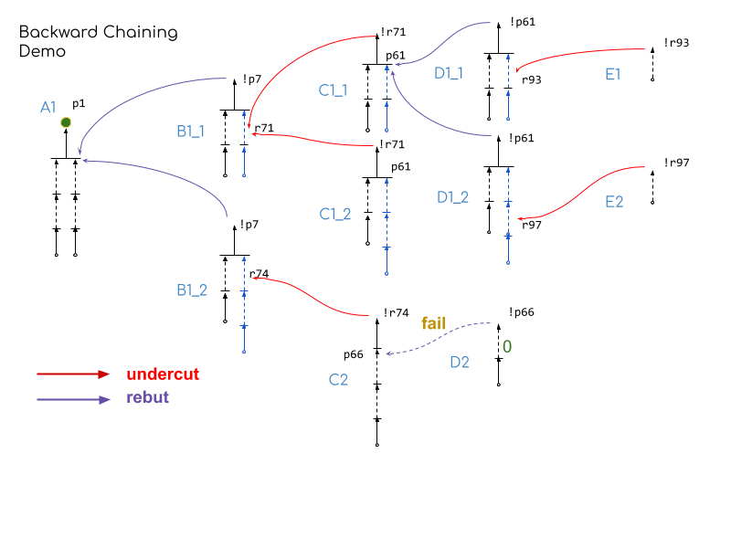
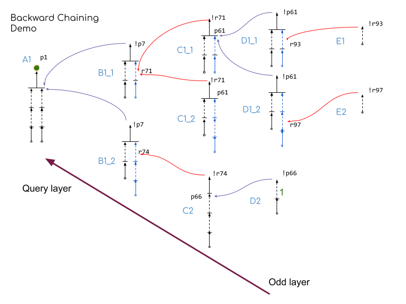
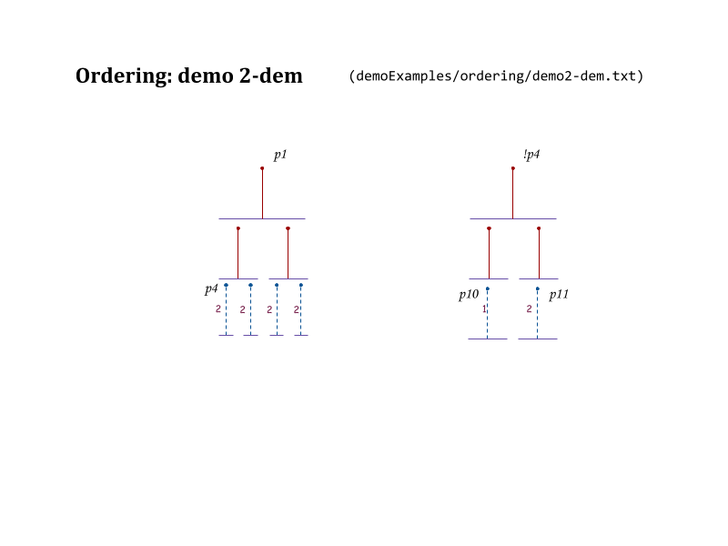
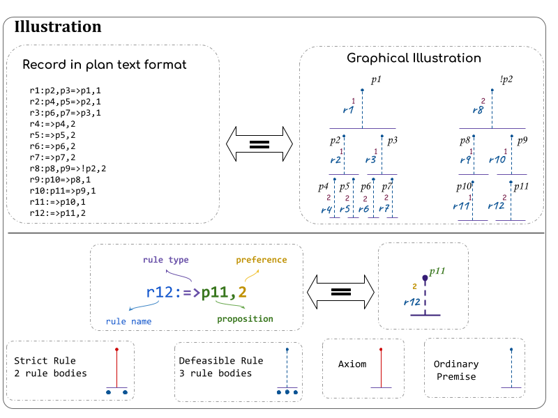
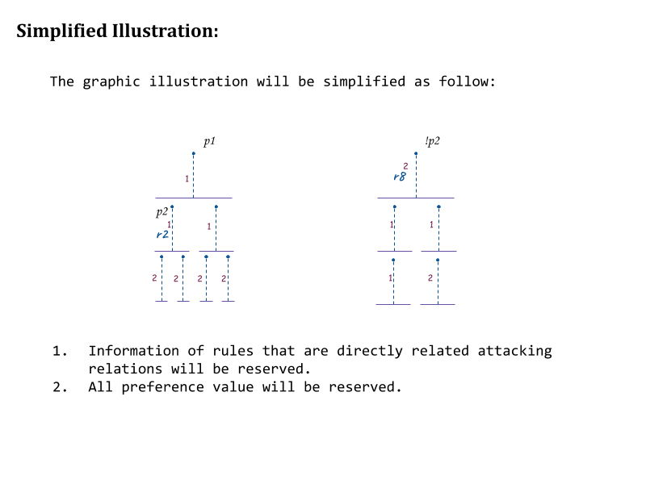
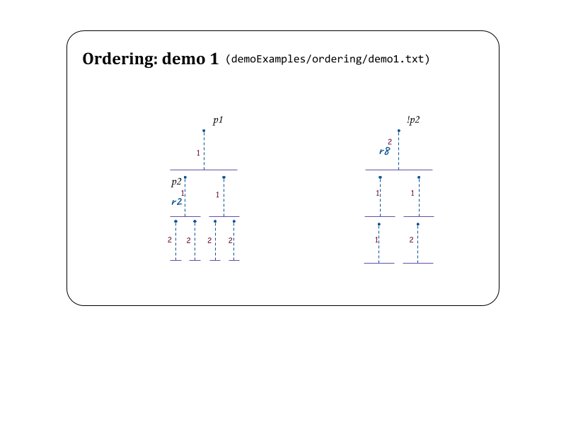
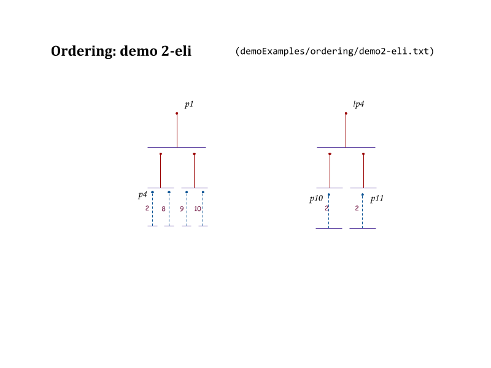
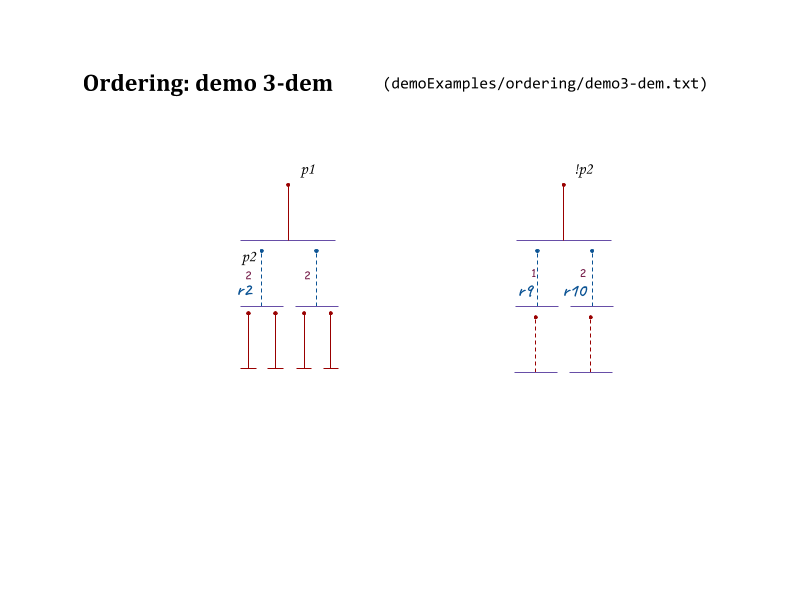
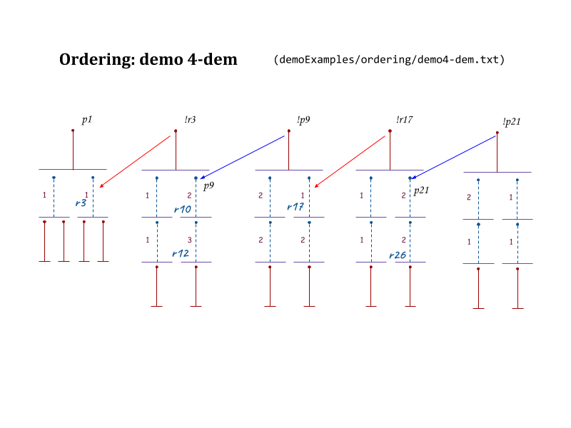
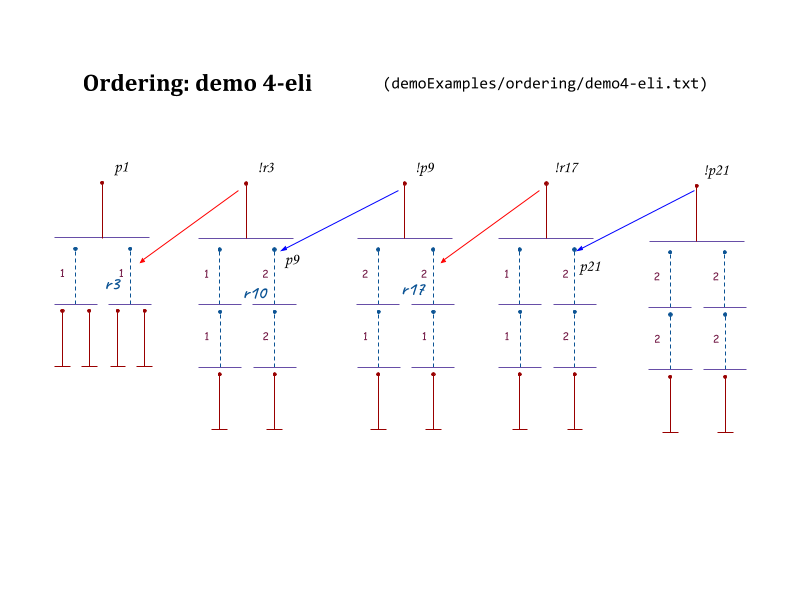

# DT examples
#### Build Project and Test
1. Build the project to get the executable file.
    > `stack build --copy-bins`
1. Demo search file is "./demoExamples/search/demo.txt" \
   If we would like to query conclusion `p1` using the priority ordering function that is the composition of `weakest-link` and `eli` then:
    > `DT-exe ./demoExamples/search/demo.txt p1 weakest-eli`

    The query result includes 9 paths, each path represents a argument that related to the query conclusion (direct/indirect support/defend).

    Priority functions include `weakest-eli`, `weakest-dem`, `last-eli`, `last-dem`. The default is `weakest-eli`.

    > ```
    > [[r6: p6 p7->p1],[r7: p8=>p6,r8: p9=>p7],[r9: p10=>p8,r10: p11=>p9],[r11: ->p10,r12: ->p11]]
    > [[r69: p54 p55->!p7],[r70: p56=>p54,r71: p57=>p55],[r72: ->p56,r73: ->p57]]
    > [[r79: p60 p61->!r71],[r80: p62=>p60,r81: p63=>p61],[r82: ->p62,r83: ->p63]]
    > [[r91: p69 p70->!p61],[r92: p71=>p69,r93: p72=>p70],[r94: ->p71,r95: ->p72]]
    > [[r99: =>!r93]]
    > [[r91: p69 p70->!p61],[r92: p71=>p69,r96: p73=>p70],[r94: ->p71,r97: p74=>p73],[r98: ->p74]]
    > [[r100: =>!r97]]
    > [[r69: p54 p55->!p7],[r70: p56=>p54,r74: p58=>p55],[r72: ->p56,r76: p59=>p58],[r78: ->p59]]
    > [[r87: p66->!r74],[r88: p67=>p66],[r89: p68=>p67],[r90: ->p68]]
    > ```

    

    **Note:**
    1. B1_1, B1_2 are equifinal paths, they all conclude `!p7`. 
        - So the same with C1_1, C1_2 and D1_1 , D1_2. 
        - Divergence of equifinal paths are blue. 
    1. Equifinal paths are ordered by the maximum depth from it's conclusion to facts.
    1. One of even-layer Equifinal Paths is successfully defended is enough. This is why `C1_2` is not in the query result. 
    1. Equifinal Path of odd layer must all be defeaded and included in the query result. 
    1. Equifinal Path of odder layer that attack but cannot defeat previous layer argument successfully will not be included in the query result, this is why `D2` is not in the query result.
    1. This default search relies on (weakest-link + dem) ordering. 
    1. D2 can not defeat C2 successfully, so that all attacker of A1 can be defeated, thus A1 can be defended indirectly. 

    Changing the preference value of the defeasible rule in D2 from 0 to 1, then D2 defeat C2 and defended B1_2 indirectly. So that B1_2 defeated A1, the query result will be empty.

    

1. Different Ordering function could lead to different query result:
In this case `weakest-link` + `dem` would provide no query result because the query path is defeated. 
```
> DT-exe ./demoExamples/ordering/demo2-dem.txt p1 weakest-dem                                                          
> 
> DT-exe ./demoExamples/ordering/demo2-dem.txt p1 weakest-eli                                                                                          
[[r1: p2 p3->p1],[r2: p4 p5->p2,r3: p6 p7->p3],[r4: =>p4,r5: =>p5,r6: =>p6,r7: =>p7]]
```


## Demo

#### Demo Illustration  
The file format is as shown below. Each demo file is equivalent to a set of paths.



    Notes, subpath that being attacked will not be shown in this. For example. sub path of `p2` in path `p1` is being attacked by path of `!p2`, it will not be drew independently. 

#### Env 
`Env` Contains context information of computing for computing the query result: 
```
data Env = Env 
    { envLangSpace :: Language            -- 1 
    , envSRuleSpace :: StrictRules        -- 2 
    , envDRuleSpace :: DefeasibleRules    -- 3 
    , envArguSpace :: ArgumentationSpace  -- 4 
    , envRdPrefMap:: RdPrefMap            -- 5 
    , envKnwlPrefMap :: KnwlPrefMap       -- 6
    } 
```
1. Language Space `L`.
2. Strict Rules      `S`.
3. Defeasible Rules     `D`. 
4. Reserved for future use. 
5. Predefined Preference Ordering of defeasible rules $\leq_d$. 
6. Predefined Preference Ordering of premises $\leq_o$. 

### Ordering Demo  
Each rule and premise is associated with an integer. The priority orderings relation is equivalent to the ordering of the associated integer. 

#### Demo1
```
stack ghci
```


1. Read context information from file
    ```
    env1 <- parseEnv "./demoExamples/ordering/demo1.txt"
    ``` 
    `env1` contains all context information of this argumentation system, `L` : LanguageSpace, `R` : Strict Rules + Defeasible Rules, `Priority Orderings` : Preference Map . 
    ```
    > env1
    LanguageSpace: [!p2,p1,p10,p11,p2,p3,p4,p5,p6,p7,p8,p9,r10: p11=>p9,r1: p2 p3=>p1,r11: =>p10,r8: p8 p9=>!p2,r7: =>p7,r6: =>p6,r4: =>p4,r3: p6 p7=>p3,r12: =>p11,r2: p4 p5=>p2,r9: p10=>p8,r5: =>p5]
    Strict Rules: []
    Defeasible Rules: [r10: p11=>p9,r1: p2 p3=>p1,r11: =>p10,r8: p8 p9=>!p2,r7: =>p7,r6: =>p6,r4: =>p4,r3: p6 p7=>p3,r12: =>p11,r2: p4 p5=>p2,r9: p10=>p8,r5: =>p5]
    ArgumentationSpace: []
    Preference Map of defeasible rules: fromList [("r10",1),("r1",1),("r8",2),("r3",1),("r2",1),("r9",1)]
    Preference Map of axiom and ordinary knowledge: fromList [("r11",1),("r7",2),("r6",2),("r4",2),("r12",2),("r5",2)]
    ```
1. Prepare application runner with context `env1`. So that we could use this runner to run context related functions. 
    ```
    run1 = runApp env1
    ```
1. Get literals the represents the query  proposition `p1`. 
    ```
    lMap = parseLiteralMap env1
    l1 = parseQueryLiteral "p1" lMap
    ```
    `l1` is of type `Literal`. 

    ```
    > l1
    p1
    > :info l1     
    l1 :: Literal       
    ```
1. Get `EFP` that concludes "p1". 
    ```
    efp1 <- run1 $ querySingleConclusion l1
    ```
    Now we have the `EFP` that concludes our query proposition `p1`.  
    ```
    > efp1
    [[[r1: p2 p3=>p1],[r2: p4 p5=>p2,r3: p6 p7=>p3],[r4: =>p4,r5: =>p5,r6: =>p6,r7: =>p7]]]
    ```
1. Check if Paths in $EFP_{p1}$ is attacked by any other $EFP$. 
    ```
    > r <- run1 $ rebutDemo' (head efp1)
    > r
    [(p2,[[[r8: p8 p9=>!p2],[r9: p10=>p8,r10: p11=>p9],[r11: =>p10,r12: =>p11]]])]
    ```
    The output indicates $PAth_{!p2}$ = `[[r8: p8 p9=>!p2],[r9: p10=>p8,r10: p11=>p9],[r11: =>p10,r12: =>p11]]`, it attacks the only path in $EFP_{p1}$ at $p2$. 
    >`head efp1` gets the only path in $EFP_{p1}$. 
    > `rebutDemo'` is auxiliary function defined in module `Utility.DemoHelp`.
1. Note: There is only one path in each $EFP$ in all ordering demos. So, I will use $path_{p1} = Path_{p1}$ to represent $EFP_{p1}$, $path_{np2} = Path_{!p2}$ to represent $EFP_{!p2}$ and so on. 
    ```
    p2 = fst . head $ r 
    path_np2 = head . snd . head $ r
    path_p2 <- fmap head $ run1 $ querySingleConclusion p2
    ```


7. Start testing Ordering Function on $path_{np2}$ and $path_{p2}$.
    `last-link` selects the last-defeasible rules, in this case `r8` from $path_np2$ and `r2` from $path_p2$. 
    ```
    > run1 $ lastDem path_np2 path_p2
    True
    > run1 $ lastEli path_np2 path_p2
    True 
    ```
    In this case, `weakest-link` select all defeasible rules and ordinary premise and compute the preference orderings respectively. `Eli` requires all component of $path_{np2}$ no less preferred than same type of components of $path_{p2}$. 
    ```
    > run1 $ weakestDem path_np2 path_p2
    True
    > run1 $ weakestEli path_np2 path_p2
    False
    ```
1. This section focus on illustrating the ordering function. Function `orderingHelper` integrated above processes and return the path that attacks our query and the subpath being attacked of our query. 
    ```
    > runner = getRunner "./demoExamples/ordering/demo1.txt"
    > (attacker,target) <- orderingHelper "./demoExamples/ordering/demo1.txt" "p1"
    > attacker
    [[r8: p8 p9=>!p2],[r9: p10=>p8,r10: p11=>p9],[r11: =>p10,r12: =>p11]]
    > target
    [[r2: p4 p5=>p2],[r4: =>p4,r5: =>p5]]
    > runner $ weakestEli attacker target
    False
    ```
#### Demo 2: 
```
stack ghci
```

1. Get runner of demo2-dem
```
> runner = getRunner "./demoExamples/ordering/demo2-dem.txt"
```
2. $Path_{p1}$ is rebutted on $p4$. 
```
> (attacker,target) <- orderingHelper "./demoExamples/ordering/demo2-dem.txt" "p1"
> attacker
[[r8: p8 p9->!p4],[r9: p10->p8,r10: p11->p9],[r11: =>p10,r12: =>p11]]
> target
[[r4: =>p4]]
> runner $ weakestEli attacker target
False
> runner $ weakestDem attacker target
True
```
`weakest` method selects all defeasible components (rules and ordinary premises). If `B` attacks `A` and `B` & `A` are all strict, the only possible scenario is `A` is an ordinary premise.In this demo, `weakest` and `last` will select the same set of defeasible components.



1. Get a runner of modified demo2. 
```
runner = getRunner "./demoExamples/ordering/demo2-eli.txt"
```
2. The change of irrelevant preference will not affect the result. 
```
> (attacker, target) <- orderingHelper "./demoExamples/ordering/demo2-eli.txt" "p1"
> runner $ weakestEli attacker target
True
> runner $ weakestDem attacker target
True
```
`weakest` method still return same set of defeasible components. In this modified example, the preference of $p10$ changed from 1 to 2, therefore, both `weakestEli` and `weakestDem` will return `True`.



1. Get a runner of demo3.
```
> runner = getRunner "./demoExamples/ordering/demo3-dem.txt"
```
1. In this demo, `weakest-link` and `last-link` will select same set of defeasible components.
```
> (attacker, target) <- orderingHelper "./demoExamples/ordering/demo3-dem.txt" "p1"
> runner $ weakestDem attacker target
True
> runner $ weakestEli attacker target
False
```


1. Get a runner of modified demo3.
```
> runner = getRunner "./demoExamples/ordering/demo3-eli.txt"
```
1. In this demo, `weakest-link` and `last-link` will select same set of defeasible components. Irrelevant component will not affect the computation. Because the preference of $r9$ changed from 1 to 2, both `Eli` and `Dem` will be `True`.
```
> (attacker, target) <- orderingHelper "./demoExamples/ordering/demo3-eli.txt" "p1"
> runner $ weakestDem attacker target
True
> runner $ weakestEli attacker target
True
```


1. Get a runner of  demo4.
```
> runner = getRunner "./demoExamples/ordering/demo4-dem.txt"
```
1. 
```
(attack, target) <- orderingHelper "./demoExamples/ordering/demo4-dem.txt" "p9"
> runner $ lastEli attack target
False
> runner $ lastDem attack target
True
> runner $ weakestEli attack target
False
> runner $ weakestDem attack target
False
```
1. 
```
(attack, target) <- orderingHelper "./demoExamples/ordering/demo4-dem.txt" "p21"
> runner $ lastDem attack target
True
> runner $ lastEli attack target
False
> runner $ weakestDem attack target
True
> runner $ weakestEli attack target
False
```



1. Get a runner of modified demo4.
```
> runner = getRunner "./demoExamples/ordering/demo4-eli.txt"
```
1. 
```
(attack, target) <- orderingHelper "./demoExamples/ordering/demo4-eli.txt" "p9"
> runner $ lastDem attack target
True
> runner $ lastEli attack target
True
> runner $ weakestDem attack target
True
> runner $ weakestEli attack target
False
```
1. 
```
(attack, target) <- orderingHelper "./demoExamples/ordering/demo4-eli.txt" "p21"
> runner $ lastDem attack target
True
> runner $ lastEli attack target
True
> runner $ weakestDem attack target
True
> runner $ weakestEli attack target
True
```

heuristic information
When there is no information about attacker and target. 
The chance of a successful attack is decreasing:
weakest + dem most promising to attack success
last + dem
last + eli
weakest + eli most promising to attack fail 

actual solution goes in parallel: need to update to a parallel version.  